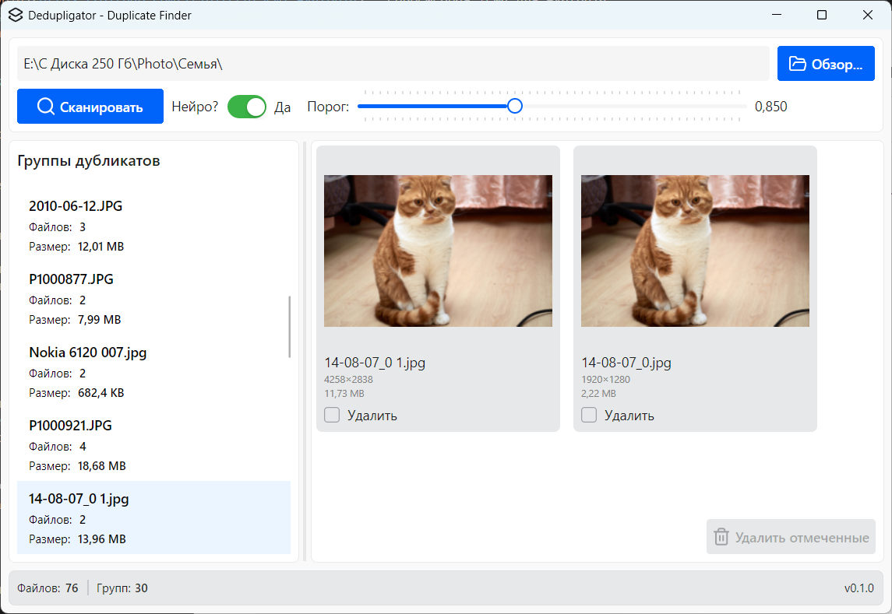
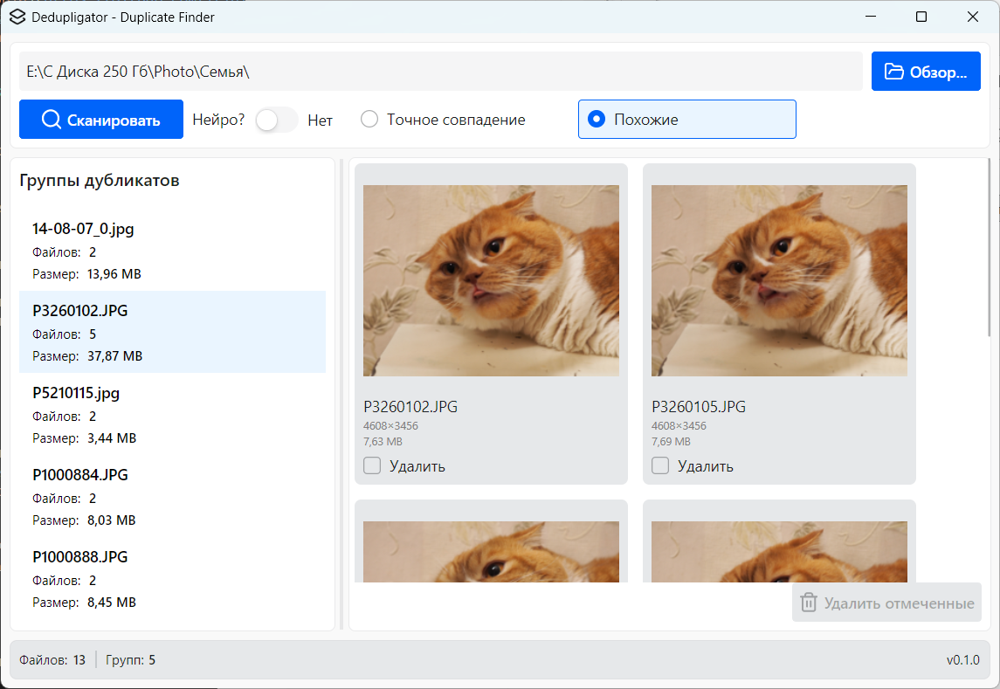
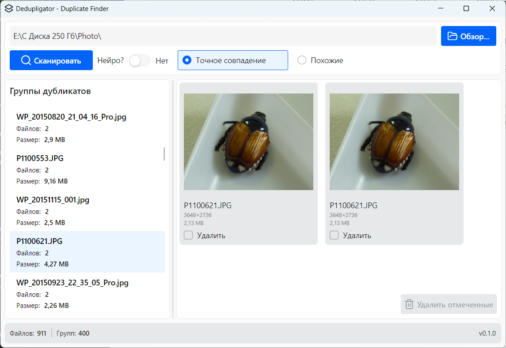

# Dedupligator - Поиск дубликатов изображений

Приложение для поиска и удаления дубликатов изображений с использованием различных методов сравнения, включая нейронные сети.

## ✨ Особенности

- **Три метода сравнения**: SHA256, pHash и нейросеть MobileNetV2
- **Современный интерфейс**: красивый и интуитивно понятный UI
- **Высокая производительность**: многопоточная обработка файлов
- **Гибкая настройка**: возможность выбрать метод сравнения и параметры
- **Настройка точности**: при использовании нейросети можно указать порог схожести (0.75-1.0)

## 🖼️ Скриншоты

## 🛠️ Технологии

- **UI Framework**: [Avalonia UI](https://avaloniaui.net/) - кроссплатформенный .NET UI фреймворк
- **Тема оформления**: [Semi.Avalonia](https://github.com/irihitech/Semi.Avalonia) - современная тема для Avalonia
- **Иконки**: [Lucide Icons](https://lucide.dev/) - красивый и современный набор иконок
- **Машинное обучение**: [ONNX Runtime](https://onnxruntime.ai/) - для работы с моделью MobileNetV2
- **Алгоритмы сравнения**: SHA256, pHash (перцептивный хеш)

## 📦 Методы сравнения изображений

### 1. Точное совпадение (SHA256)
Сравнивает точные хеши файлов. Находит идентичные файлы (даже с разными именами).

### 2. Похожие (pHash)
Находит визуально похожие изображения, даже если они имеют разные размеры или формат.

### 3. Нейросеть (MobileNetV2)
Использует глубокое обучение для поиска семантически похожих изображений. Находит дубликаты с изменениями: обрезка, поворот, изменение цвета и т.д.

**При использовании нейросети можно указать порог схожести (0.75-1.0):**
- Чем выше порог, тем точнее должна быть схожесть изображений
- Рекомендуемое значение: 0.85

## 📥 Установка

### Установщик для Windows

1. Скачайте последнюю версию установщика из раздела [Releases](https://github.com/dimka59ru/dedupligator/releases)
2. Запустите файл `Dedupligator-Setup-{version}.exe`
3. Если Windows блокирует установку:
   - Щелкните правой кнопкой мыши на файле установщика
   - Выберите "Свойства"
   - Во вкладке "Общие" нажмите "Разблокировать"
   - Нажмите "ОК" и запустите установщик

## 🚀 Использование

1. Запустите приложение
2. Выберите папку для поиска дубликатов
3. Выберите метод сравнения:
   - **Точное совпадение** (SHA256) - для точных дубликатов
   - **Похожие** (pHash) - для похожих изображений
   - **Нейросеть** (MobileNetV2) - для семантически похожих изображений
4. При выборе нейросети укажите порог схожести (0.75-1.0)
5. Нажмите "Начать поиск"
6. Просмотрите найденные дубликаты и выберите файлы для удаления

## 📁 Структура проекта

Dedupligator/
├── Dedupligator.App/ # Основное приложение (Avalonia UI)
│ └── Assets/
│ └── logo.ico # Иконка приложения
├── Dedupligator.Common/ # Общие utilities и helpers
├── Dedupligator.Services/ # Бизнес-логика и сервисы
│ └── Assets/
│ └── mobilenetv2-7.onnx # Модель нейронной сети
└── ...

## 🤝 Участие в разработке

Мы приветствуем вклад в развитие проекта! Чтобы внести свой вклад:

1. Форкните репозиторий
2. Создайте ветку для вашей функции (`git checkout -b feature/amazing-feature`)
3. Закоммитьте изменения (`git commit -m 'Add some amazing feature'`)
4. Запушьте в ветку (`git push origin feature/amazing-feature`)
5. Откройте Pull Request

## 📄 Лицензия

Этот проект распространяется под лицензией MIT. Подробнее см. в файле [LICENSE](LICENSE).

## ⚠️ Известные проблемы

- При первом запуске может потребоваться время для инициализации нейронной сети
- Нейросеть требует значительных ресурсов при обработке большого количества изображений
- Функция удаления найденных дубликатов еще не реализована (в разработке)

## 📞 Поддержка

Если у вас возникли проблемы или есть предложения:

1. Откройте [Issue](https://github.com/dimka59ru/dedupligator/issues) на GitHub
2. Напишите на email: rizan59ru@yandex.ru

---

⭐ Если вам нравится этот проект, поставьте звезду на GitHub!
